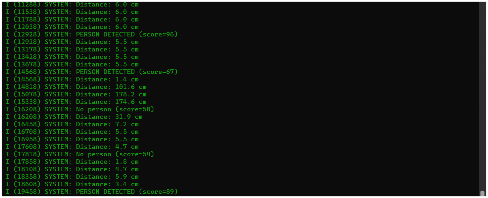
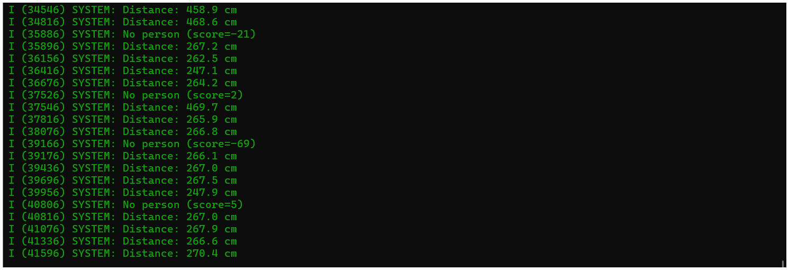
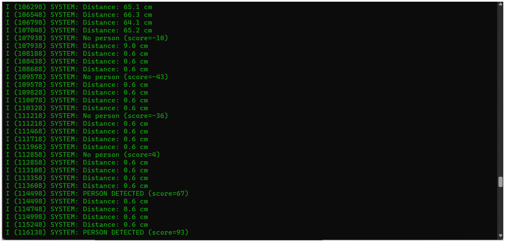

# ESP32-CAM Person Detection & Obstacle Monitoring System

---

## Table of Contents

1. [Overview](#1-overview)
2. [Quick Start](#2-quick-start)
3. [Hardware Requirements](#3-hardware-requirements)
4. [Wiring Guide](#4-wiring-guide)
5. [Software Setup](#5-software-setup)
6. [Build & Flash](#6-build--flash)
7. [System Architecture](#7-system-architecture)
8. [System Flowchart](#8-system-flowchart)
9. [ML Inference Pipeline](#9-ml-inference-pipeline)
10. [FreeRTOS Tasks](#10-freertos-tasks)
11. [System Operation](#11-system-operation)
12. [Troubleshooting](#12-troubleshooting)
13. [Project Structure](#13-project-structure)

---

## 1. Overview

This project implements a real-time person detection system with obstacle monitoring on the ESP32-CAM platform. It combines machine learning inference with ultrasonic distance sensing to create an intelligent embedded system.

**Key Features:**
- Person detection using quantized MobileNet (96x96 grayscale input)
- Ultrasonic distance measurement (2cm - 400cm range)
- Multi-task FreeRTOS architecture
- Low-latency LED indicators for visual feedback

**System Specifications:**

| Parameter | Value |
|----|----|
| ML Inference Time | 200-300ms |
| Detection Rate | 1.25 Hz |
| Distance Sampling | 4 Hz |
| Memory Usage | 140KB tensor arena |

---

## 2. Quick Start

```bash
# 1. Clone repository
git clone https://gitlab.com/your-username/esp32-person-detection.git
cd esp32-person-detection

# 2. Clone TensorFlow Lite component
mkdir -p components && cd components
git clone https://github.com/espressif/esp-tflite-micro.git
cd ..

# 3. Configure PSRAM (required)
idf.py menuconfig
# Navigate: Component config > ESP PSRAM > Enable

# 4. Build and flash
idf.py build
idf.py -p /dev/ttyUSB0 flash monitor
```

> **Note:** Replace `/dev/ttyUSB0` with your port (Windows: `COM3`, `COM4`, etc.)

---

## 3. Hardware Requirements

### Components List

| Component | Specification | Quantity | Notes |
|-----------|---------------|----------|-------|
| ESP32-CAM | ESP32-S | 1 | With OV2640 camera |
| HC-SR04 | Ultrasonic sensor | 1 | 3.3V operation |
| LED (Yellow) | 5mm standard | 1 | Far indicator |
| LED (Green) | 5mm standard | 1 | Near indicator |
| Resistor | 220Ω | 2 | Current limiting |
| USB-UART | FTDI/CP2102 | 1 | For programming |
| Jumper Wires | Male-Female | ~10 | For connections |

---

## 4. Wiring Guide

### 4.1 Pin Connections


### 4.2 Complete Wiring Table

| Component        | Pin         | ESP32-CAM | Connection         | Notes             |
|-----------------|-------------|-----------|----------------------|--------------------|
| **Far LED (Yellow)** | Anode (+)   | GPIO 14  | Via 220Ω resistor  | External LED       |
|                 | Cathode (-) | GND       | Direct              | Common ground      |
| **Near LED (Green)** | Anode (+)   | GPIO 15  | Via 220Ω resistor  | External LED       |
|                 | Cathode (-) | GND       | Direct              | Common ground      |
| **HC-SR04**     | VCC         | 3.3V        | Direct              | Power rail         |
|                 | TRIG        | GPIO 12   | Direct              | Trigger pulse      |
|                 | ECHO        | GPIO 13   | Direct              | Echo input         |
|                 | GND         | GND       | Direct              | Common ground      |
| **OV2640 Camera** | Multiple    | Pre-wired | Ribbon cable        | On-board           |
| **Power Supply** | Positive (+) | 3.3V        | Direct              | 3.3V/2A minimum      |
|                 | Negative (-) | GND       | Direct              | Common ground      |

### 4.3 GPIO Assignment Table

| GPIO | Function | Direction | Notes |
|------|----------|-----------|-------|
| 12 | HC-SR04 TRIG | Output | Trigger pulse |
| 13 | HC-SR04 ECHO | Input | Echo response |
| 14 | Far LED | Output | Object 20-50cm |
| 15 | Near LED | Output | Object <20cm |

### 4.4 Flashing Wiring

```
USB-UART           ESP32-CAM
--------           ---------
TX      ─────────► U0R
RX      ─────────► U0T
GND     ─────────► GND
VCC     ─────────► 3.3V      
```

> **Important:** Connect GPIO0 to GND only during flashing. Disconnect after upload.

---

## 5. Software Setup

### 5.1 Prerequisites

| Software | Version | Download |
|----------|---------|----------|
| ESP-IDF | v5.5.1 | [Download](https://dl.espressif.com/dl/esp-idf/) |
| Python | 3.7+ | [Download](https://python.org) |

### 5.2 Installation Steps

**Step 1: Install ESP-IDF**

**Step 2: Clone Project**

```bash
git clone https://gitlab.com/your-username/esp32-person-detection.git
cd esp32-person-detection
```

**Step 3: Add TensorFlow Lite Component**

```bash
mkdir -p components
cd components
git clone https://github.com/espressif/esp-tflite-micro.git
cd ..
```

**Final Project Structure:**

```
esp32-person-detection/
├── main/
│   ├── main.cpp
│   ├── camera_handler.c
│   ├── camera_handler.h
│   ├── led_control.c
│   ├── led_control.h
│   ├── hcsr04.c
│   ├── hcsr04.h
│   ├── model_data.cc
│   └── CMakeLists.txt
├── components/
│   └── esp-tflite-micro/
├── CMakeLists.txt
└── README.md
```

---

## 6. Build & Flash

 **Step 1: Enable PSRAM**

```bash
idf.py menuconfig
```

Navigate to:
```
Component config
  └── ESP PSRAM
      └── [*] Support for external, SPI-connected RAM
      └── SPI RAM config
          └── Type: Auto detect
          └── Speed: 40MHz
```

 **Step 2: Build**

```bash
idf.py build
```

Expected output:
```
Project build complete. To flash, run:
idf.py flash
```

 **Step 3: Flash**

```bash
# Linux/Mac

idf.py -p /dev/ttyUSB0 flash

# Windows
idf.py -p COMx flash
#Example:Use COM3, COM4, etc.
```

 **Step 4: Monitor**

```bash
idf.py -p COM3 monitor

# Or combined:
idf.py -p /dev/ttyUSB0 flash monitor
# Example: idf.py -p COM3 flash monitor
```

Press `Ctrl+]` to exit monitor.

### Expected Boot Output

```
I (123) SYSTEM: Initializing NVS...
I (145) CAMERA: Initializing ESP32-CAM with PSRAM...
I (156) CAMERA: ✓ PSRAM detected
I (157) CAMERA:   Total: 4194304 bytes (4.0 MB)
I (158) CAMERA:   Free: 4128564 bytes (3.9 MB)
I (234) CAMERA: ✓ Camera initialized successfully!
I (235) CAMERA:   Model: OV2640
I (236) CAMERA:   Resolution: 96x96 pixels
I (237) CAMERA:   Format: GRAYSCALE
I (245) SYSTEM: Initializing LEDs...
I (250) SYSTEM: Initializing HC-SR04...
I (260) SYSTEM: Creating synchronization primitives...
I (270) SYSTEM: Initializing TensorFlow Lite...
I (450) SYSTEM: ✓ TFLM initialized successfully
I (451) SYSTEM:   Arena used: 138240 / 143360 bytes (96.4%)
I (460) SYSTEM: Creating message queues...
I (465) SYSTEM: Creating FreeRTOS tasks...
I (470) SYSTEM: ========================================
I (471) SYSTEM:   SYSTEM STARTED SUCCESSFULLY
I (472) SYSTEM: ========================================
I (480) SYSTEM: Distance: 45.2 cm
I (490) SYSTEM: ○ No person (score=25, no_person=85)
I (1290) SYSTEM: Distance: 44.8 cm
I (1490) SYSTEM: ✓ PERSON DETECTED (score=92, no_person=35)
```
---

## 7. System Architecture

```
┌─────────────────────────────────────────────────────────────┐
│                    SYSTEM ARCHITECTURE                      │
├─────────────────────────────────────────────────────────────┤
│                                                             │
│  ┌──────────┐         ┌────────────────┐                    │
│  │  OV2640  │  96x96  │   ESP32-CAM    │                    │
│  │  Camera  │────────►│  ML Inference  │                    │
│  └──────────┘         │   + FreeRTOS   │                    │
│                       └───────┬────────┘                    │
│  ┌──────────┐                 │                             │
│  │  HC-SR04 │    Distance     │                             │
│  │  Sensor  │────────────────►│                             │
│  └──────────┘                 │                             │
│                               ▼                             │
│                    ┌──────────────────┐                     │
│                    │  Decision Logic  │                     │
│                    └────────┬─────────┘                     │
│                             │                               │
│              ┌──────────────┼──────────────┐                │
│              ▼              ▼              ▼                │
│        ┌──────────┐  ┌──────────┐  ┌──────────┐             │
│        │ Far LED  │  │ Near LED │  │  Serial  │             │
│        │ (GPIO14) │  │ (GPIO15) │  │   Log    │             │
│        └──────────┘  └──────────┘  └──────────┘             │
│                                                             │
└─────────────────────────────────────────────────────────────┘
```

---

## 8. System Flowchart

### 8.1 Complete System Flow

```
                    +---------------------+
                    |   SYSTEM POWER ON   |
                    +----------+----------+
                               |
                    +----------v----------+
                    | Initialize Hardware |
                    | - NVS Flash         |
                    | - Camera (OV2640)   |
                    | - LEDs (GPIO)       |
                    | - HC-SR04 Sensor    |
                    +----------+----------+
                               |
                    +----------v----------+
                    | Initialize Software |
                    | - TensorFlow Lite   |
                    | - Allocate 140KB    |
                    | - Load ML Model     |
                    | - Create Mutex      |
                    +----------+----------+
                               |
                    +----------v----------+
                    |   Create FreeRTOS   |
                    | - Message Queues    |
                    | - 3 Tasks (P4-P6)   |
                    +----------+----------+
                               |
                    +----------v----------+
                    |   Start Scheduler   |
                    +----------+----------+
                               |
        +----------------------+---------------------+
        |                      |                     |
+-------v--------+      +------v-------+      +------v-------+
| Person Detect  |      | Sensor Read  |      |  Actuator    |
|  Task (P6)     |      |  Task (P5)   |      |  Task (P4)   |
| 800ms cycle    |      | 250ms cycle  |      | 100ms cycle  |
+-------+--------+      +------+-------+      +------+-------+
        |                      |                     |
+-------v--------+      +------v-------+             |
| Capture Image  |      | Trigger      |             |
| 96x96          |      | Sensor       |             |
| Grayscale      |      | 10us Pulse   |             |
+-------+--------+      +------+-------+             |
        |                      |                     |
+-------v--------+      +------v-------+             |
| Preprocess     |      | Measure Echo |             |
| uint8 -> int8  |      | Calculate cm |             |
+-------+--------+      +------+-------+             |
        |                      |                     |
+-------v--------+      +------v-------+      +------v-------+
| Run ML Model   |      | Publish to   |      | Read Queues  |
| Inference      |      | qSensor      |      | - qDetect    |
| 200-300ms      |      |              |      | - qSensor    |
+-------+--------+      +--------------+      +------+-------+
        |                                            |
+-------v--------+                          +--------v-------+
| Threshold      |                          | Apply Rules    |
| score > 60?    |                          | Priority Logic |
+-------+--------+                          +--------+-------+
        |                                            |
+-------v--------+                          +--------v-------+
| Publish to     |                          | Update LEDs    |
| qDetect        |                          | - Person       |
+----------------+                          | - Far/Near     |
        |                                   +--------+-------+
        |                                            |
        +--------------------+-----------------------+
                             |
                   +---------v---------+
                   | REPEAT FOREVER    |
                   | (Task Loops)      |
                   +-------------------+
```

---

## 9. ML Inference Pipeline
```
+-------------------------------------------------------------+
| STEP 1: IMAGE CAPTURE                                       |
|                                                             |
|  +--------------+                                           |
|  |   OV2640     | esp_camera_fb_get()                       |
|  |   Camera     |----------------> [96x96 uint8 pixels]     |
|  +--------------+      Frame Buffer (PSRAM)                 |
|                                                             |
|  Time: 50-80ms                                              |
+-------------------------------------------------------------+
                              |
                              v
+-------------------------------------------------------------+
| STEP 2: PREPROCESSING                                       |
|                                                             |
|  FOR each pixel (i = 0 to 9215):                            |
|      int8_value[i] = uint8_pixel[i] - 128                   |
|                                                             |
|  Conversion:                                                |
|      White (255) -> +127                                    |
|      Gray  (128) ->    0                                    |
|      Black (  0) -> -128                                    |
|                                                             |
|  Result: [96x96 int8 array]                                 |
|  Time: 5-10ms                                               |
+-------------------------------------------------------------+
                              |
                              v
+-------------------------------------------------------------+
| STEP 3: LOAD INPUT TENSOR                                   |
|                                                             |
|  xSemaphoreTake(tflite_mutex, 5000ms)  [Acquire Lock]       |
|                                                             |
|  memcpy(input_tensor->data.int8, preprocessed_image, 9216)  |
|                                                             |
|  Input Tensor Shape: [1, 96, 96, 1]                         |
|  Data Type: int8_t (quantized)                              |
+-------------------------------------------------------------+
                              |
                              v
+-------------------------------------------------------------+
| STEP 4: NEURAL NETWORK INFERENCE                            |
|                                                             |
|  interpreter->Invoke()                                      |
|                                                             |
|  Layer-by-Layer Processing:                                 |
|  +------------------------------------------------------+   |
|  | Conv2D #1         | Feature extraction               |   |
|  | DepthwiseConv2D   | Efficient processing             |   |
|  | AveragePool2D     | Spatial downsampling             |   |
|  | Conv2D #2         | Higher-level features            |   |
|  | Reshape           | Flatten to 1D                    |   |
|  | FullyConnected    | Classification layer             |   |
|  | Softmax           | Probability distribution         |   |
|  +------------------------------------------------------+   |
|                                                             |
|  Working Memory: 140KB Tensor Arena (PSRAM)                 |
|  Time: 200-300ms                                            |
+-------------------------------------------------------------+
                              |
                              v
+-------------------------------------------------------------+
| STEP 5: EXTRACT OUTPUT                                      |
|                                                             |
|  Output Tensor Shape: [1, 2]                                |
|  Data Type: int8_t                                          |
|                                                             |
|  int8_t score_no_person = output_tensor->data.int8[0];      |
|  int8_t score_person    = output_tensor->data.int8[1];      |
|                                                             |
|  Example Output:                                            |
|      [45, 82] -> Person detected (82 > 45)                  |
|      [90, 30] -> No person (90 > 30)                        |
+-------------------------------------------------------------+
                              |
                              v
+-------------------------------------------------------------+
| STEP 6: THRESHOLD DECISION                                  |
|                                                             |
|  IF (score_person > THRESHOLD):                             |
|      person_detected = TRUE                                 |
|  ELSE:                                                      |
|      person_detected = FALSE                                |
|                                                             |
|  THRESHOLD = 60 (adjustable)                                |
|  confidence_score = score_person                            |
+-------------------------------------------------------------+
                              |
                              v
+-------------------------------------------------------------+
| STEP 7: PUBLISH RESULT                                      |
|                                                             |
|  detect_msg_t result = {                                    |
|      .person = person_detected,                             |
|      .score  = score_person                                 |
|  };                                                         |
|                                                             |
|  xQueueOverwrite(qDetect, &result);                         |
|                                                             |
|  xSemaphoreGive(tflite_mutex)  [Release Lock]               |
+-------------------------------------------------------------+
                              |
                              v
+-------------------------------------------------------------+
| STEP 8: CLEANUP                                             |
|                                                             |
|  camera_return_fb(frame_buffer)                             |
|  [Return frame buffer to PSRAM pool]                        |
|                                                             |
|  vTaskDelay(800ms)                                          |
|  [Wait before next inference cycle]                         |
+-------------------------------------------------------------+
```
**Model Details:**

| Property | Value |
|----------|-------|
| Input Shape | [1, 96, 96, 1] |
| Output Shape | [1, 2] |
| Quantization | INT8 |
| Arena Size | 140KB |
| Operations | Conv2D, DepthwiseConv2D, AveragePool2D, Reshape, Softmax, FullyConnected |

---

## 10. FreeRTOS Tasks

### 10.1 Task Specifications

| Task Name | Priority | Stack (bytes) | Cycle Time | CPU Usage | Function |
|-----------|----------|---------------|------------|-----------|----------|
| `task_person_detection` | 6 (Highest) | 8192 | 800ms | ~35% | Capture image, run ML inference, publish results |
| `task_sensor_read` | 5 (High) | 2048 | 250ms | ~2% | Read ultrasonic sensor, calculate distance |
| `task_actuator` | 4 (Medium) | 2048 | 100ms | <1% | Read queues, apply control logic, update LEDs |

### 10.2 Inter-Task Communication

| Queue Name | Message Type | Size | Mode | Purpose |
|------------|--------------|------|------|---------|
| `qDetect` | `detect_msg_t` (2 bytes) | 1 slot | Overwrite | Person detection results |
| `qSensor` | `sensor_msg_t` (4 bytes) | 1 slot | Overwrite | Distance measurements |

**Message Structures:**

```c
typedef struct {
    bool person;      // TRUE if person detected
    int8_t score;     // Confidence score (0-127)
} detect_msg_t;

typedef struct {
    float distance_cm;  // Distance in cm, -1.0 on error
} sensor_msg_t;
```

### 10.3 LED Control Logic

| Condition | Far LED | Near LED | Description |
|-----------|---------|----------|-------------|
| `person == TRUE` | OFF | OFF | Person detected (LEDs disabled) |
| `person == FALSE`, dist < 20cm | OFF | ON | Near obstacle (danger zone) |
| `person == FALSE`, dist 20-50cm | ON | OFF | Far obstacle (warning zone) |
| `person == FALSE`, dist > 50cm | OFF | OFF | Clear path |
| `person == FALSE`, dist == -1.0 | OFF | OFF | Sensor error (safe default) |

---
## 11. System Operation
### 11.1 System Boot Sequence
```
+==================================================================+
|                        SYSTEM BOOT SEQUENCE                      |
+==================================================================+

[ STEP 1 ] Power-On / Hardware Reset
    |
    +-- ESP-IDF Bootloader
            |
            +-- Validates Flash Partition Table
            +-- Loads Application Image into Instruction Memory

--------------------------------------------------------------------

[ STEP 2 ] app_main() Entry Point
    |
    +-- Initialize NVS (Non-Volatile Storage)
            |
            +-- SUCCESS → Continue
            +-- FAILURE → Erase → Re-init
            +-- If still failing → System Halt

--------------------------------------------------------------------

[ STEP 3 ] Hardware Subsystem Initialization
    |
    +-- [3.1] OV2640 Camera (ESP32-CAM Interface)
    |        |
    |        +-- Check PSRAM Availability (4 MB mapped)
    |        +-- Configure Camera GPIO Matrix (14 Pins)
    |        +-- Set Format: 96 × 96, GRAYSCALE
    |        +-- Initialize Sensor Driver (OV2640)
    |        +-- Warm-up Test Capture → OK
    |
    +-- [3.2] LED Indicators (Two LEDs)
    |        |
    |        +-- FAR_LED   (GPIO14) → OFF
    |        +-- NEAR_LED  (GPIO4)  → OFF
    |
    +-- [3.3] HC-SR04 Ultrasonic Sensor
             |
             +-- TRIG (GPIO12) → Output
             +-- ECHO (GPIO13) → Input
             +-- Test Distance Read → OK

--------------------------------------------------------------------

[ STEP 4 ] Software & ML Engine Initialization
    |
    +-- [4.1] Create Synchronization Primitives
    |        |
    |        +-- tflite_mutex (Binary Semaphore)
    |
    +-- [4.2] Initialize TensorFlow Lite Micro (TFLM)
    |        |
    |        +-- Allocate Tensor Arena (140 KB in PSRAM)
    |        +-- Load ML Model (Flash Memory)
    |        +-- Register Supported Ops:
    |              Conv2D, DepthwiseConv2D,
    |              AveragePool2D, Reshape,
    |              Softmax, FullyConnected
    |        +-- Allocate Tensors (Input / Output)
    |        +-- TFLM Ready → OK
    |
    +-- [4.3] Create Real-Time Queues
             |
             +-- qDetect → 1-slot overwrite (Struct: person + score)
             +-- qSensor → 1-slot overwrite (Float: distance)

--------------------------------------------------------------------

[ STEP 5 ] Create FreeRTOS Multi-Core Tasks
    |
    +-- task_person_detection
    |        Priority: 6 (Critical)
    |        Stack: 8192 bytes
    |        Function:
    |            - Capture camera frame
    |            - Preprocess 96×96 → int8
    |            - ML inference → score
    |            - Publish detection message
    |
    +-- task_sensor_read
    |        Priority: 5 (High)
    |        Stack: 2048 bytes
    |        Function:
    |            - Read HC-SR04 distance
    |            - Publish latest distance
    |
    +-- task_actuator
             Priority: 4 (Medium)
             Stack: 2048 bytes
             Function:
                 - Fetch detect + distance
                 - Person override logic
                 - Drive FAR / NEAR LEDs

--------------------------------------------------------------------

[ STEP 6 ] Start FreeRTOS Scheduler
    |
    +-- All created tasks enter READY → RUNNING
    +-- System transitions to continuous real-time operation

+==================================================================+
|                            SYSTEM READY                          |
|                    Entering Normal Operation Mode                |
+==================================================================+
```
### 11.2 Runtime Behavior

**Person Detection Task (800ms cycle):**

1. Capture 96×96 grayscale image 
2. Preprocess to INT8 format 
3. Acquire mutex (timeout 5s)
4. Run TFLite inference
5. Check if score > 60 threshold
6. Publish result to qDetect
7. Release mutex
8. Return frame buffer
9. Wait 800ms, repeat

**Sensor Read Task (250ms cycle):**

1. Send 10µs trigger pulse to HC-SR04
2. Wait for ECHO rising edge
3. Measure ECHO pulse duration
4. Convert to distance (cm)
5. Publish to qSensor
6. Wait 250ms, repeat

**Actuator Task (100ms cycle):**

1. Peek qDetect (non-blocking)
2. Peek qSensor (non-blocking)
3. Apply priority decision logic
4. Update LED states via GPIO
5. Wait 100ms, repeat


### 11.3 Live Working Output Images

### 📷 Person Detected
Below is the live output :





---

## 12. Troubleshooting

| Problem                      | Symptom                              | Solution                                                       |
|------------------------------|----------------------------------------|----------------------------------------------------------------|
| **PSRAM Not Detected**       | "PSRAM NOT DETECTED" error            | Run `idf.py menuconfig`, enable PSRAM, then rebuild            |
| **Camera Init Failed**       | Error code 0x105 (ESP_ERR_NOT_FOUND)  | Check camera ribbon cable and ensure it is properly seated     |
| **Brown-out Reset**          | System continuously resets             | Use a stable 5V/2A power supply instead of USB power           |
| **Sensor Returns -1.0**      | "Distance: ERROR" logs                 | Verify HC-SR04 wiring: VCC=3.3V, GND, TRIG=GPIO12, ECHO=GPIO13 |
| **Never Detects Person**     | Score always low                       | Lower PERSON_SCORE_THRESHOLD (e.g., 60 → 40)                   |
| **Too Many False Positives** | Detects when no person present         | Increase PERSON_SCORE_THRESHOLD (e.g., 60 → 80)                |
| **Slow Inference**           | Inference > 400ms                      | Ensure CPU frequency is set to 240 MHz                         |
| **Upload Failed**            | Cannot flash firmware                  | Connect GPIO0 to GND while flashing                            |

### Debug Commands

```bash
# Check available ports
ls /dev/ttyUSB*          # Linux
ls /dev/cu.*             # Mac

# Erase flash completely
idf.py erase_flash

# Verbose logging
idf.py menuconfig
# Component config > Log output > Default log verbosity: Debug
```

---

## 13. Project Structure

```
esp32_person_detection/
│
├── main/
│   ├── main.cpp                 # Application entry, FreeRTOS tasks
│   ├── camera_handler.c         # Camera initialization and capture
│   ├── camera_handler.h         # Camera API definitions
│   ├── led_control.c            # GPIO LED control functions
│   ├── led_control.h            # LED API definitions
│   ├── hcsr04.c                 # HC-SR04 ultrasonic driver
│   ├── hcsr04.h                 # Sensor API definitions
│   ├── model_data.cc            # TFLite model (generated)
│   └── CMakeLists.txt           # Main component build config
│
├── components/
│   └── tflite-lib/              # TensorFlow Lite library
│       ├── CMakeLists.txt
│       └── include/             # TFLite headers
│
├── CMakeLists.txt               # Top-level build configuration
├── sdkconfig                    # ESP-IDF configuration
├── sdkconfig.defaults           # Default configuration
└── README.md                    # Project documentation
```

---


## APPENDIX A: Quick Reference Card

```
╔════════════════════════════════════════════════════════════════╗
║              ESP32-CAM QUICK REFERENCE CARD                    ║
╚════════════════════════════════════════════════════════════════╝

POWER SUPPLY:
  • Voltage: 3.3V DC
  • Current: 2A minimum (peak: 500mA, avg: 150mA)
  • Connector: FTDI Programmer and USB cable
  • WARNING: USB 2.0 ports insufficient!

GPIO CONNECTIONS:
  • Far LED (yellow):     GPIO 14 + 220Ω resistor
  • Near LED (orange):    GPIO 4 + 220Ω resistor
  • HC-SR04 TRIG:         GPIO 12
  • HC-SR04 ECHO:         GPIO 13
  • HC-SR04 VCC:          3.3V rail
  • Common Ground:         GND

LED BEHAVIOR:
  • Far LED ON            = Obstacle = 21-50cm away
  • Near LED ON           = Obstacle <=20cm (danger!)
  • All LEDs OFF          = Clear path

SYSTEM PARAMETERS:
  • Person Threshold:      60 (adjustable 0-127)
  • Far Distance:          50cm (adjustable)
  • Near Distance:         20cm (adjustable)
  • Detection Rate:        1.25 Hz (every 800ms)
  • Sensor Rate:           4 Hz (every 250ms)

BUILD COMMANDS:
  idf.py menuconfig       # Configure PSRAM
  idf.py build            # Compile firmware
  idf.py flash            # Upload to device
  idf.py monitor          # View serial output
  idf.py flash monitor    # Flash + monitor

TROUBLESHOOTING:
  • "PSRAM NOT DETECTED"  → Enable in menuconfig
  • Camera init fails     → Check ribbon cable
  • Brownout resets       → Use 5V/2A power supply
  • Sensor returns -1.0   → Check HC-SR04 wiring
  • No person detection   → Lower threshold (60→40)
  • Too sensitive         → Raise threshold (60→80)

MONITOR OUTPUT:
  ✓ PERSON DETECTED (score=XX) = Person found
  ○ No person (score=XX)        = No detection
  Distance: XX.X cm             = Sensor reading
  Distance: ERROR               = Sensor timeout

EMERGENCY RESET:
  • Press RESET button on ESP32-CAM
  • Power cycle (unplug/replug 3.3V)
  • Reflash firmware: idf.py erase_flash flash
```
